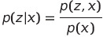
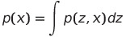
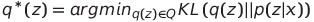
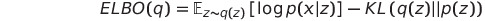
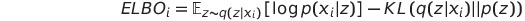
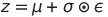
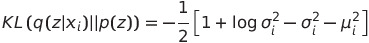
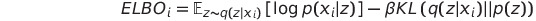

# Variational Autoencoder

Tensorflow implementation of dense variational autoencoder for MNIST dataset.

### Background

#### 1. Variational Inference

In probabilistic modelling, one is often interested in inferring the posterior 
distribution p(z|x) of some latent variables z given the observations x

The term in the denominator of above equation is called the evidence, the 
calculation of which results in solving the following integral

Unfortunately, this integral is hard to compute as it needs to be evaluated 
over all configuration of latent variables z. Variational inference solves 
this problem by approximating the posterior distribution p(z|x) 
using optimization. 

In variational inference we first choose a family Q of variational densities 
q(z) over the latent variables z. The optimization problem then results 
in searching for a candidate, which minimizes the Kullback-Leibler (KL) 
divergence between the true posterior p(z|x) and its approximation q(z)

This objective is still intractable, since it still results in solving the 
above integral. Since the KL divergence cannot be computed, an alternative 
objective - the evidence lower bound (ELBO) - is optimized, which corresponds 
to the KL divergence except for a constant. Maximizing the ELBO is equivalent 
to minimizing the KL divergence.

The first term in the ELBO objective is the expected likelihood, 
which encourages the variational density q(z) of latent variables z to explain 
the observations well. The second term is the negative KL divergence, which 
encourages the variational density q(z) to be close to the prior p(z).

#### 2. Variational Autoencoder

Variational autoencoder (VAE) is a deep neural network architecture, designed to 
efficiently perform variational inference on large scale datasets using 
stochastic gradient descent (SGD). Similar to regular autoencoder, VAE consists 
of an encoder and a decoder network, jointly trained to produce good 
reconstructions of input data.

In VAEs, we use the encoder to parametrize the approximate posterior q(z|x) 
with an inference neural network, which takes as input a single observation 
x and returns the parameters of Q, typically chosen  to be Gaussian. Similar, 
we use the decoder to parametrize the likelihood p(x|z) with generative neural 
network, which takes as input samples of latent variables z and outputs parameters 
of the observations distribution, typical chosen to be Bernoulli or Gaussian.

Since VAEs use SGD to jointly optimize the parameters 
of both networks, one needs to calculate the ELBO for each observation separately. 
This can easily be done under assumption, that the latent variables z are not 
shared among the different observations. However, since in SGD one commonly minimizes 
a loss  function with respect to network’s parameters, in VAE we minimize the negative 
of the ELBO objective.

In order to be able to compute the gradients with respect to the parameters of the 
VAE model, Kingma and Welling [1] introduce the reparametrization trick, which 
allows sampling z from q(z|x) using the parameters of Q and a noise variable &epsilon;.

The expected likelihood in the ELBO objective is typically obtained by calculating either 
the mean squared error or the binary crossentropy between the true observations and 
the reconstruction of the decoder network, depending on either the probability density 
of observations, p(x|z), has been chosen to be Gaussian or Bernoulli, respectively.
Finally, by choosing both q(z|x) and p(z) to be Gaussian distributions, one can derive 
a closed form solution of the KL term in the ELBO objective.

#### 3. Disentangled representations learning

According to Bengio [2], high dimensional real world data can be explained by a much smaller 
number of independent latent factors of variation, which are commonly referred to as 
disentangled representations. In machine learning, one is interested in learning such 
representations in unsupervised fashion, by only considering the observations at hand. 
A model that is able to learn disentangled representations, by only observing the 
unlabeled data, can be used to improve supervised learning of downstream tasks, given 
limited amount of labeled data [2].

Modern state-of-the-art approaches for learning disentangled representations are mainly 
based on variational autoencoders. In &beta;-VAE [3], disentangled representation learning 
is forced by introducing an additional constraint &beta;>1 to the KL term, resulting in 
the following objective

### Results

The following figure shows how different digits are clustered within the latent space.

The following figure shows how digits are reconstructed by the model.

### References

1. Kingma, D. P., & Welling, M. (2013). Auto-encoding variational bayes. 
([arXiv:1312.6114](https://arxiv.org/pdf/1312.6114.pdf))
2. Bengio, Y., Courville, A., & Vincent, P. (2013). Representation learning: 
A review and new perspectives. IEEE transactions on pattern analysis and 
machine intelligence, 35(8), 1798-1828.
3. Burgess, C. P., Higgins, I., Pal, A., Matthey, L., Watters, N., 
Desjardins, G., & Lerchner, A. (2018). Understanding disentangling 
in $\beta$-VAE. ([arXiv:1804.03599](https://arxiv.org/pdf/1804.03599.pdf))