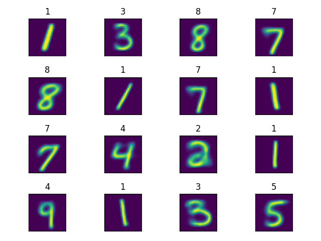

# Variational Autoencoder

Tensorflow implementation of dense variational autoencoder for MNIST dataset.

### Background

#### 1. Variational Inference

In probabilistic modeling, one is often interested in inferring the posterior 
distribution p(z|x) of some latent variable z given the observations x

The term in the denominator of equation (1) is called the evidence, the 
calculation of which results in solving the following integral

Unfortunately, the integral in equation (2) is hard to compute since 
it must be evaluated over all configurations of the latent variable z. 
Variational inference solves this problem by approximating the posterior 
distribution p(z|x) in equation (1) using optimization. 

In variational inference, we first choose a family Q of variational 
densities q(z) over the latent variables z. The optimization problem 
then results in searching for a candidate that satisfies the 
Kullback-Leibler (KL) divergence between the true posterior p(z|x) 
and its approximation q(z)

The objective in equation (3) is still intractable. To show this, 
we first rewrite the KL divergence term

Substituting equation (1) into equation (4), we obtain

which again results in solving the integral of equation (2). 
Since the KL divergence in equation (3) cannot be computed, an 
alternative objective is optimized which corresponds to the 
KL divergence except for a constant

The objective in equation (6) is called the evidence lower bound (ELBO). 
Maximizing the ELBO is equivalent to minimizing the KL divergence of 
equation (3), since the ELBO target is equal to the sum of the 
negative KL divergence and log p(x). The latter one is constant with 
respect to q(z).

Substituting (1) into (6), we obtain

The first term on the right-hand side of equation (7) is the expected 
likelihood which encourages the variational density q(z) of the latent 
variable to explain the observations well. The second term is the 
negative KL divergence, which encourages the variation density q(z) 
to be close to the prior p(z).

Another property of the ELBO that explains its name is that it defines 
the lower bound of the evidence in equation (2). To show this, we add 
equations (5) and (6) together and obtain

Since the KL divergence is always non-negative (which can be proved by 
Jensen's inequality) log p(x) is always greater than or equal to ELBO.

#### 2. Variational Autoencoder

Variational autoencoder (VAE) is a deep neural network architecture, designed to 
efficiently perform variational inference on large scale datasets using 
stochastic gradient descent (SGD). Similar to regular autoencoder, VAE consists 
of an encoder and a decoder network, jointly trained to produce good 
reconstructions of input data.

In VAE, we use the encoder to parameterize the approximate posterior 
q&theta;(z|x) with an inference neural network with 
parameters &theta; (i.e., weights and biases) that takes as input 
a single observation x and returns the parameters of Q, typically chosen 
to be Gaussian. Similarly, we use the decoder to parameterize the 
probability p&phi;(x|z) with a generative neural network 
with parameters &phi;, which takes as input samples of latent variables 
z and outputs parameters of the distribution of observations, typically 
chosen to be Bernoulli or Gaussian.

Since VAEs use SGD to jointly optimize the parameters &theta; and &phi;
of both networks, one needs to calculate the ELBO for each observation separately. 
This can easily be done under assumption, that the latent variables z are not 
shared among the different observations

However, since in SGD one commonly minimizes a loss  function with respect 
to network’s parameters, in VAE we minimize the negative of the ELBO objective 
in equation (9).

In order to be able to compute the gradients with respect to the parameters of the 
VAE model, Kingma and Welling [1] introduce the reparametrization trick, which 
allows sampling z from q&theta;(z|x) using the parameters of Q and 
a noise variable &epsilon;

By choosing both q&theta;(z|x) and p(z) to be Gaussian 
distributions, one can derive a closed form solution of the KL term in the 
equation (9)

The expected likelihood in equation (9) is typically obtained by calculating 
either the mean squared error or the binary cross entropy between the true 
observations and the reconstruction of the decoder network, depending on 
whether the probability density of the observations, p&phi;(x|z), has 
been chosen to be Gaussian or Bernoulli, respectively.

#### 3. Disentangled representations learning

According to Bengio [2], high dimensional real world data can be explained by 
a much smaller number of independent latent factors of variation, which are 
commonly referred to as disentangled representations. In machine learning, 
one is interested in learning such representations in unsupervised fashion, 
by only considering the observations at hand. A model that is able to learn 
disentangled representations, by only observing the unlabeled data, can be 
used to improve supervised learning of downstream tasks, given limited amount 
of labeled data [2].

Modern state-of-the-art approaches for learning disentangled representations 
are mainly based on variational autoencoders. In &beta;-VAE [3], for example, 
disentangled representation learning is forced by introducing an additional 
constraint &beta;>1 to the KL term, resulting in the following objective

### Results

The following figure shows how different digits are clustered within the latent space.

The following figure shows how digits are reconstructed by the model.

### References

1. Kingma, D. P., & Welling, M. (2013). Auto-encoding variational bayes. 
([arXiv:1312.6114](https://arxiv.org/pdf/1312.6114.pdf))
2. Bengio, Y., Courville, A., & Vincent, P. (2013). Representation learning: 
A review and new perspectives. IEEE transactions on pattern analysis and 
machine intelligence, 35(8), 1798-1828.
3. Burgess, C. P., Higgins, I., Pal, A., Matthey, L., Watters, N., 
Desjardins, G., & Lerchner, A. (2018). Understanding disentangling 
in $\beta$-VAE. ([arXiv:1804.03599](https://arxiv.org/pdf/1804.03599.pdf))