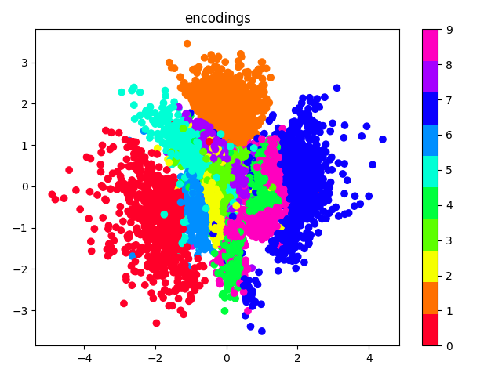

# Variational Autoencoder

Tensorflow implementation of dense variational autoencoder for MNIST dataset.

### Background

In probabilistic modelling, one is often interested in inferring the posterior 
distribution p(z|x) of some latent variables z given the observations x. Variational 
inference solves this problem by approximating the posterior distribution p(z|x) 
using optimization. 

In variational inference we first choose a family Q of variational densities 
q(z) over the latent variables z. The optimization problem then results 
in searching for a candidate, which minimizes the Kullback-Leibler (KL) 
divergence between the true posterior p(z|x) and its approximation q(z).

Since the KL divergence cannot be computed, an alternative objective - the 
evidence lower bound (ELBO) - is optimized, which corresponds to the KL 
divergence except for a constant. Maximizing the ELBO is equivalent to minimizing 
the KL divergence.

The first term in the ELBO objective is the expected likelihood, 
which encourages the variational density q(z) of latent variables z to explain 
the observations well. The second term is the negative KL divergence, which 
encourages the variational density q(z) to be close to the prior p(z).

Variational autoencoder (VAE) is a deep neural network architecture, designed to 
efficiently perform variational inference on large scale datasets using 
stochastic gradient descent (SGD). Similar to regular autoencoder, VAE consists 
of an encoder and a decoder network, jointly trained to produce good 
reconstructions of input data.

In VAEs, we use the encoder to parametrize the approximate posterior q(z|x) 
with an inference neural network, which takes as input a single observation 
x and returns the parameters of Q, typically chosen  to be Gaussian. Similar, 
we use the decoder to parametrize the likelihood p(x|z) with generative neural 
network, which takes as input samples of latent variables z and outputs parameters 
of the observations distribution, typical chosen to be Bernoulli or Gaussian.

Since VAEs use SGD to jointly optimize the parameters 
of both networks, one needs to calculate the ELBO for each observation separately. 
This can easily be done under assumption, that the latent variables z are not 
shared among the different observations. However, since in SGD one commonly minimizes 
a loss  function with respect to network’s parameters, in VAE we minimize the negative 
of the ELBO objective.

In order to be able to compute the gradients with respect to the parameters of the 
VAE model, Kingma and Welling [1] introduce the reparametrization trick, which 
allows sampling z from q(z|x) using the parameters of Q and a noise variable ε.

The expected likelihood in the ELBO objective is typically obtained by calculating either 
the mean squared error or the binary crossentropy between the true observations and 
the reconstruction of the decoder network, depending on either the probability density 
of observations, p(x|z), has been chosen to be Gaussian or Bernoulli, respectively.
Finally, by choosing q(z|x) and p(z) to be Gaussian, one can derive a closed form solution 
of the KL term in the ELBO objective.

### Results

### References

1. Kingma, D. P., & Welling, M. (2013). Auto-encoding variational bayes. 
([arXiv:1312.6114](https://arxiv.org/pdf/1312.6114.pdf))
2. Burgess, C. P., Higgins, I., Pal, A., Matthey, L., Watters, N., 
Desjardins, G., & Lerchner, A. (2018). Understanding disentangling 
in $\beta$-VAE. ([arXiv:1804.03599](https://arxiv.org/pdf/1804.03599.pdf))